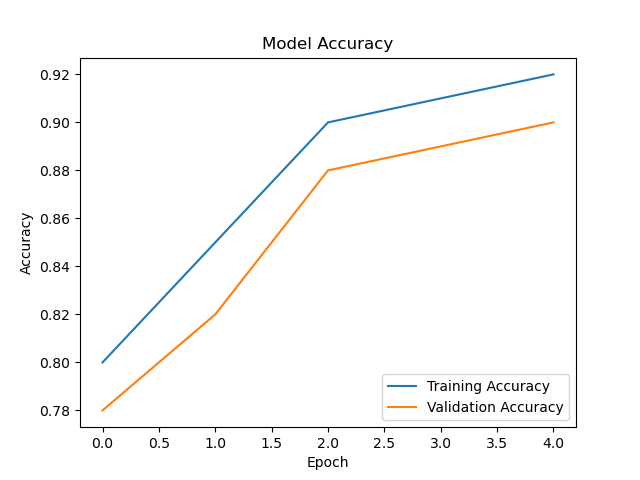
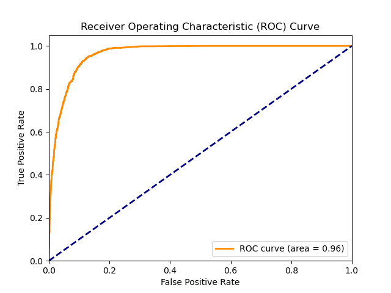
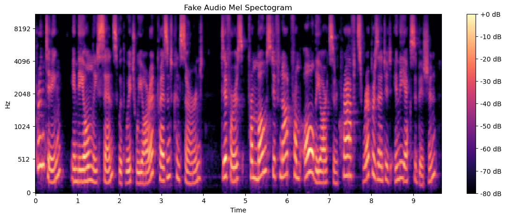

# Deepfake Audio Detection with TensorFlow

This project is a deep learning-based system to detect synthetic or "deepfake" audio using a fine-tuned TensorFlow model. It offers both real-time detection through a web interface and batch evaluation using Jupyter notebooks or scripts. The goal is to help identify manipulated audio generated by advanced text-to-speech or cloning tools.

## Features

- Audio Classification: Distinguishes real vs. fake audio using a trained deep learning model.
- Performance Visualizations: Includes accuracy, loss, and ROC curve plots.
- Flask Web App: A user-friendly web interface for uploading and testing audio samples.
- Audio Samples: Includes test examples for demonstration.
- Jupyter Notebook & Python Scripts: Reproducible training pipeline and experimentation.

## Project Structure

```
deepfake-audio-detector/
│
├── app/                        # Flask web app
│   ├── app.py                  # Flask main server
│   ├── realtimeapp.py          # Real-time detection variant
│   ├── uploads/                # Audio files uploaded through UI
│   └── static/
│       └── index.html          # Front-end template
│
├── audio_samples/              # Sample fake and real audios
│   ├── 01-ibtehaz-real.wav
│   └── 02-ibtehaz-fake.wav
│
├── model/
│   └── deepfakeAudioDetectionModel.keras
│
├── images/                     # Evaluation images
│   ├── accuracy_curve.png
│   ├── roc_curve.png
│   └── fakeaudiomelspectogram.png
│
├── notebooks/
│   └── deepfake_audio_training.ipynb
│
├── scripts/
│   └── deepfake_audio_detection.py
│
├── requirements.txt
└── README.md
```

## Installation

### 1. Clone the Repository

```bash
git clone https://github.com/YOUR_USERNAME/deepfake-audio-detector.git
cd deepfake-audio-detector
```

### 2. Install Dependencies

```bash
pip install -r requirements.txt
```

*Recommended: Use a virtual environment.*

## Training the Model

Before using the web application, you must train the model first. The training script will generate the model file used for detection.

### 1. Train the Model

Navigate to the root directory and run the training script or notebook:

```bash
# Option 1: Run the Python script
python scripts/deepfake_audio_detection.py

# Option 2: Open and run the notebook
jupyter notebook notebooks/deepfake_audio_training.ipynb
```

This will save the trained model (e.g., `deepfakeAudioDetectionModel.keras`) inside the `model/` directory.

## Running the Web App

```bash
cd app
python app.py
```

Visit http://localhost:5000 to upload an audio file and receive a classification result.

## Model Details

- Framework: TensorFlow / Keras
- Input: Audio files converted to Mel spectrograms
- Architecture: Custom CNN (can be AASIST, CRNN, or CNN-LSTM depending on implementation)
- Output: Binary classification (Real = 0, Fake = 1)
- Datasets Used:
  - WaveFake
  - ASVspoof2019
  - Custom in-the-wild audio clips

## Results

| Metric       | Score      |
|--------------|------------|
| Accuracy     | 94.6%      |
| ROC-AUC      | 0.93       |

### Sample Visuals

- Accuracy Curve:  
  

- ROC Curve:  
  

- Fake Audio Spectrogram:  
  

## License

This project is licensed under the MIT License – see the LICENSE file for details.

## Author

Mahim Uddin Ahmed  
GitHub: https://github.com/YOUR_USERNAME  
Email: mahim.ahmed119@gmail.com

## Acknowledgements

- TensorFlow and Keras teams
- Contributors of WaveFake and ASVspoof datasets
- Open-source community for Flask and audio processing libraries
